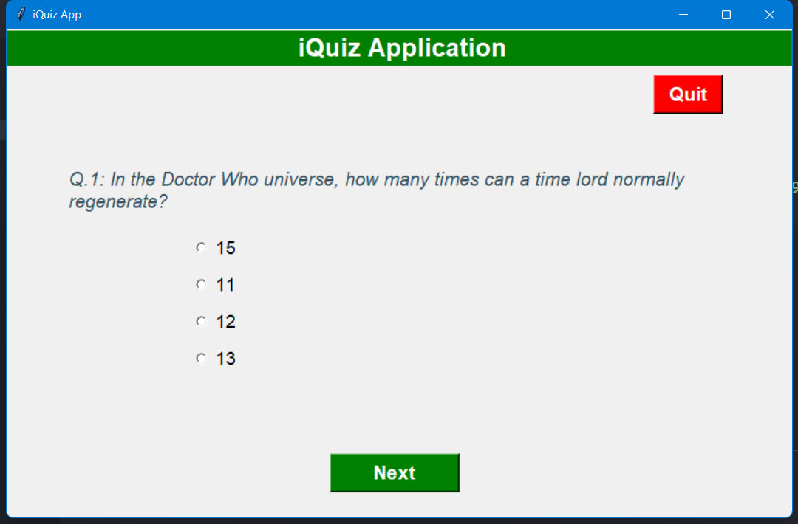
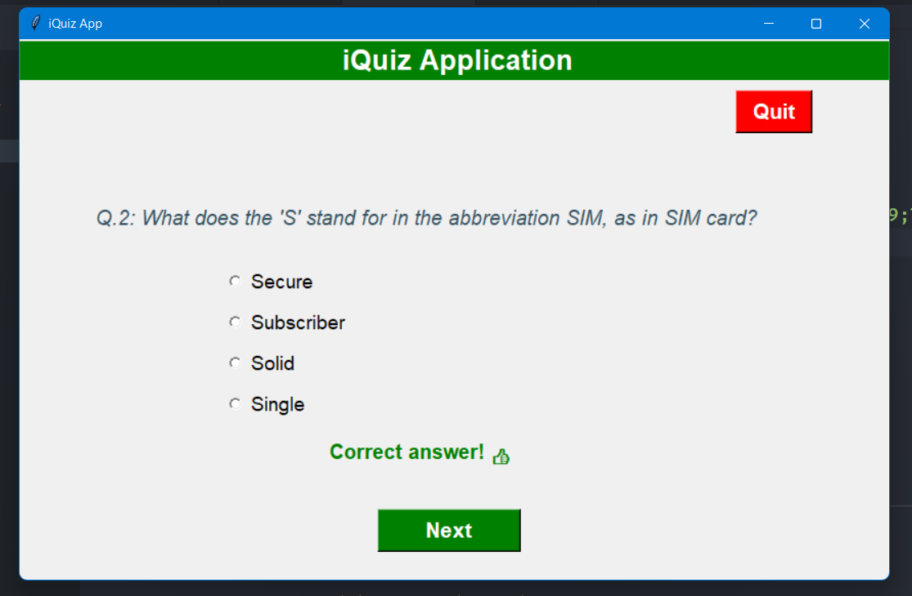
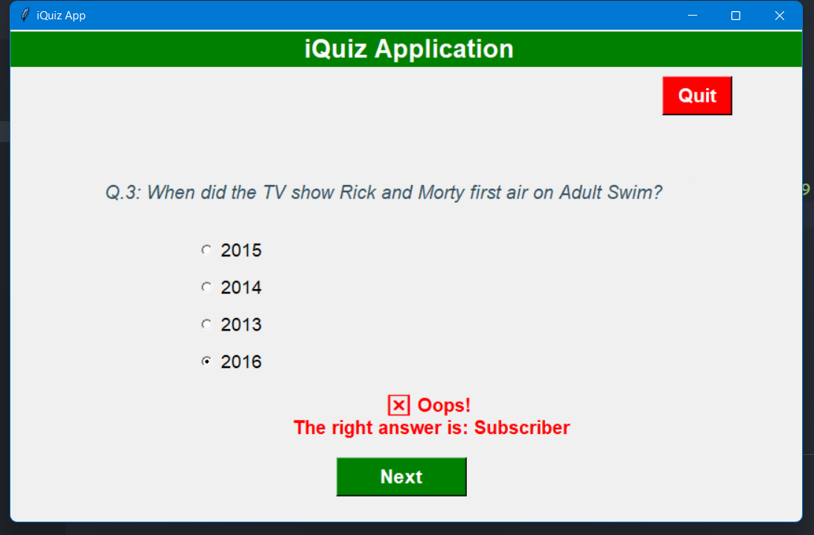
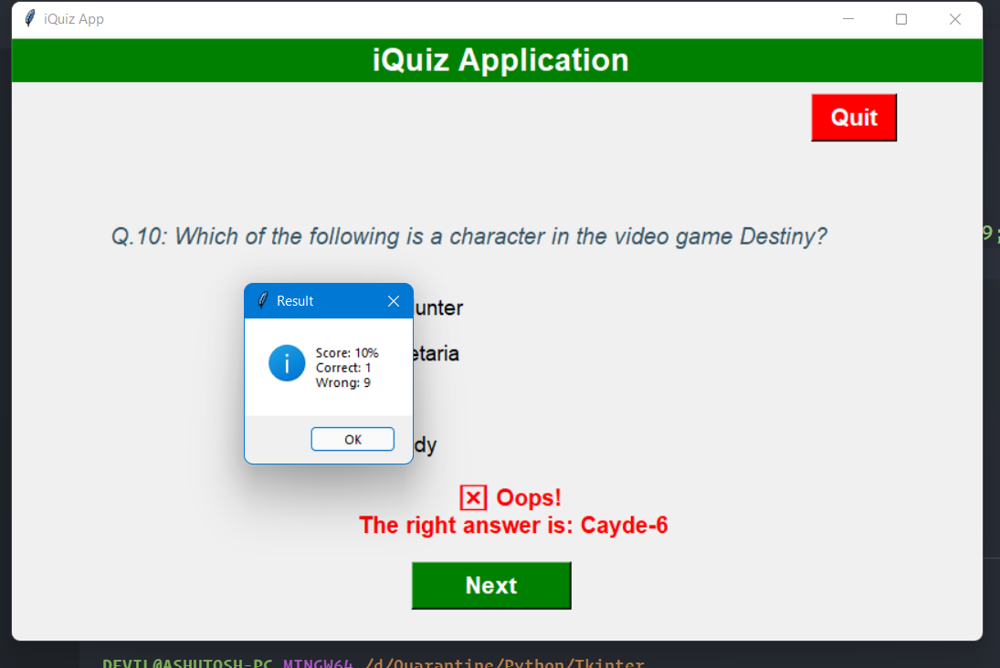

# GUI Quiz Application using Tkinter and Open Trivia DB

Read The Blog on iRead: https://ireadblog.com/posts/137/how-to-build-a-gui-quiz-application-using-tkinter-and-open-trivia-db
Download for Windows [here](https://github.com/ashutoshkrris/GUI-Quiz-Tkinter/raw/master/quiz.exe)

### Screenshots

 

 

 

